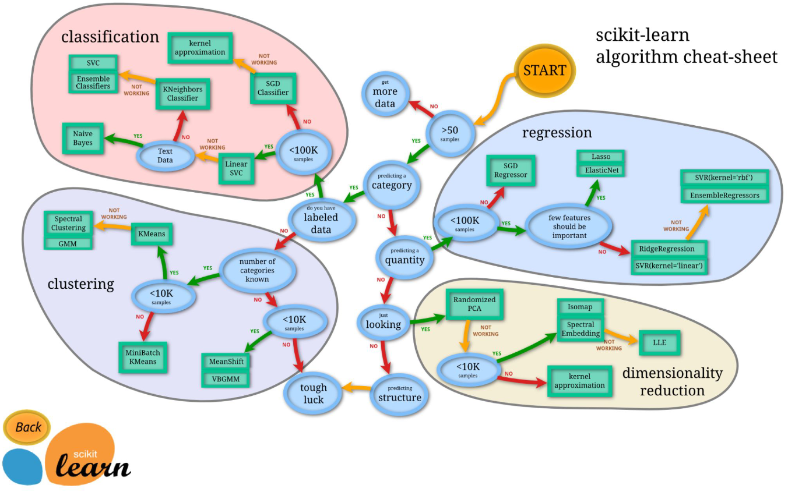

# sklearn Guideline

# Correlation

## Tarea:

- Investigar correlación de Spearman y de Pearson

- Consultar los métodos de características no supervisadas (En qué situaciones son especialmente efectivos)

- Métricas típicas para evaluar calidad de caracteristicas seleccionadas por algoritmos no supervisados.
